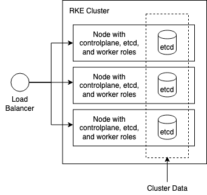
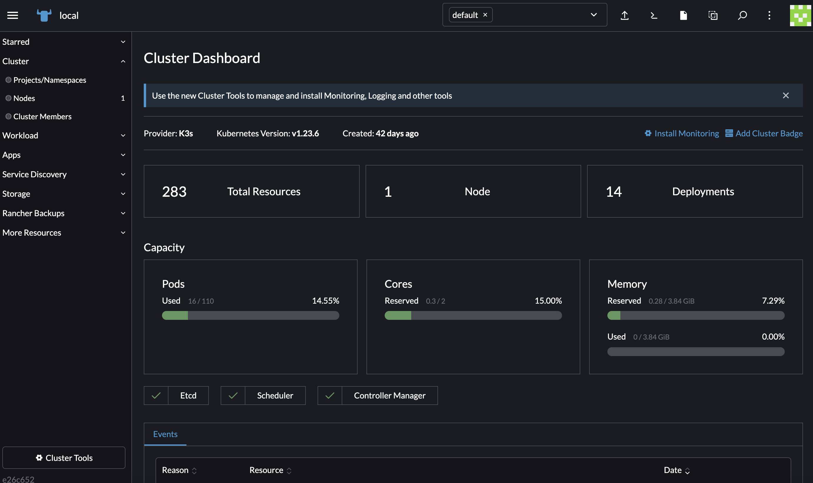

RKE 是一个快速的，多功能的 Kubernetes 安装工具。

## 安装软件和配置先决条件
请检查节点是否满足这些要求。


### 系统配置

#### Hostname和MAC地址唯一
使用以下命令查看Hostname和MAC地址
```bash
cat /etc/hostname

ip link
```

#### 启用IPV4流量转发
执行以下命令
```bash
cat <<EOF | sudo tee /etc/modules-load.d/k8s.conf
overlay
br_netfilter
EOF

sudo modprobe overlay
sudo modprobe br_netfilter

# sysctl params required by setup, params persist across reboots
cat <<EOF | sudo tee /etc/sysctl.d/k8s.conf
net.bridge.bridge-nf-call-iptables  = 1
net.bridge.bridge-nf-call-ip6tables = 1
net.ipv4.ip_forward                 = 1
EOF

# Apply sysctl params without reboot
sudo sysctl --system
```

通过运行以下命令验证 br_netfilter, overlay 模块是否已加载
```bash
lsmod | grep br_netfilter
lsmod | grep overlay
```

通过运行以下命令验证 net.bridge.bridge-nf-call-iptables, net.bridge.bridge-nf-call-ip6tables, net.ipv4.ip_forward系统变量已设置为1
```bash
sysctl net.bridge.bridge-nf-call-iptables net.bridge.bridge-nf-call-ip6tables net.ipv4.ip_forward
```

#### 关闭SELinux
执行以下命令
```
setenforce 0
sed -i 's/enforcing/disabled/' /etc/selinux/config
```

#### 关闭防火墙
Ubuntu执行以下命令
```bash
ufw disable
```
Centos执行以下命令
```bash
systemctl stop firewalld
systemctl disable firewalld
```

#### 禁用交换分区
执行以下命令
```
swapoff -a 
sed -ri 's/.*swap.*/#&/' /etc/fstab
```

#### 创建rke用户
```bash
useradd -m rke

#设置密码
passwd rke
```

### 安装软件


#### Docker
参考文档：https://docs.docker.com/engine/install
执行以下命令
```bash
curl -fsSL https://get.docker.com -o get-docker.sh
sh ./get-docker.sh

systemctl enable docker
systemctl start docker
```

执行以下命令验证Docker是否已正确安装
```bash
systemctl status docker
docker version
docker run hello-world
```

创建docker用户组
```bash
groupadd docker
```

添加rke用户至docker用户组
```bash
usermod -aG docker rke
```

激活对用户组的修改
```bash
newgrp docker
```

验证rke用户是否可执行docker命令
```bash
su rke
docker run hello-world
```


#### Chrony
使用Chrony同步服务器时间
执行以下命令安装
```bash
apt install chrony
systemctl enable chrony
systemctl start chrony
```

验证
```bash
chronyc activity
```

### 主节点配置
以下操作，选择一台主节点即可。

#### 生成SSH证书
执行以下命令会在当前目录生成两个文件：rke_key, rke_key.pub
```bash
ssh-keygen -t rsa -b 4096 -C "your_email@example.com" -P "" -f rke_key
```

#### 拷贝SSH证书至所有节点
```bash
ssh-copy-id -i rke_key.pub rke@node1
ssh-copy-id -i rke_key.pub rke@node2
ssh-copy-id -i rke_key.pub rke@node3
...
```

#### 验证SSH证书是否可用
```bash
ssh -t  -i rke_key rke@node1 "hostname"
```

#### 安装Kubectl
参考文档：https://kubernetes.io/docs/tasks/tools/install-kubectl-linux/
执行以下命令安装
```bash
curl -LO "https://dl.k8s.io/release/$(curl -L -s https://dl.k8s.io/release/stable.txt)/bin/linux/amd64/kubectl"

chmod +x kubectl
mv kubectl /usr/local/bin/kubectl
```

验证
```
kubectl version
```

开启自动补全
```bash
source <(kubectl completion bash) # set up autocomplete in bash into the current shell, bash-completion package should be installed first.
echo "source <(kubectl completion bash)" >> ~/.bashrc # add autocomplete permanently to your bash shell.
```

#### 安装RKE
下载二进制安装包，RKE版本发布页面：https://github.com/rancher/rke/releases 
```bash
# Linux
curl -LO https://github.com/rancher/rke/releases/download/v1.4.17/rke_linux-amd64
```

把二进制文件重命名为rke
```
# Linux
mv rke_linux-amd64 rke

# MacOS
mv rke_darwin-amd64 rke

# Windows PowerShell
mv rke_windows-amd64.exe rke.exe
```

添加可执行权限
```bash
chmod +x rke
```

把rke移动到Linux可以执行命令目录下
```bash
mv rke /usr/local/bin/rke
```

执行以下命令验证
```bash
rke --version
```

## 使用RKE部署集群
参考文档：https://rke.docs.rancher.com

### 创建RKE配置文件
创建一个名为`cluster.yml`的 Kubernetes 集群配置文件；在后续步骤中，当使用 RKE 命令设置集群时，它将使用此文件在节点上安装 Kubernetes。

#### 集群配置建议

每个节点可承担一个或多个角色
* 三个**controlplane**节点，保证 master 组件的高可用性
* 三个**etcd**节点，保证etcd组件的高可用性
* 多个**worker**节点，用于部署应用和服务

示例：

| 节点 | 角色 |
| --- | --- |
| 192.168.11.1 | controlplane, etcd, worker  |
| 192.168.11.2 | controlplane, etcd, worker  |
| 192.168.11.3 | controlplane, etcd, worker  |
| 192.168.11.4 | worker  |
| 192.168.11.5 | worker  |


#### 使用rke config
创建rke配置文件
```bash
rke config --name cluster.yml
```

参考以下选择：
```bash
[+] Cluster Level SSH Private Key Path [~/.ssh/id_rsa]: rke_key #SSH私钥文件路径
[+] Number of Hosts [1]: 1 #集群节点数量
[+] SSH Address of host (1) [none]: 192.168.11.1 #第一个节点的IP地址
[+] SSH Port of host (1) [22]: 22 #SSH端口
[+] SSH Private Key Path of host (192.168.11.1) [none]: rek_key #SSH私钥路径
[+] SSH User of host (192.168.11.1) [ubuntu]: rke #SSH远程登录用户
[+] Is host (192.168.11.1) a Control Plane host (y/n)? [y]: y #是否为控制节点
[+] Is host (192.168.11.1) a Worker host (y/n)? [n]: y #是否为worker节点
[+] Is host (192.168.11.1) an etcd host (y/n)? [n]: y #是否为etcd节点
[+] Override Hostname of host (192.168.11.1) [none]: #是否覆盖现有主机名
[+] Internal IP of host (192.168.11.1) [none]: #节点内部IP地址
[+] Docker socket path on host (192.168.11.1) [/var/run/docker.sock]: #节点docker.sock路径
[+] Network Plugin Type (flannel, calico, weave, canal, aci) [canal]: #网络插件
[+] Authentication Strategy [x509]: #认证策略
[+] Authorization Mode (rbac, none) [rbac]: #权限模式
[+] Kubernetes Docker image [rancher/hyperkube:v1.27.12-rancher1]: #集群容器镜像
[+] Cluster domain [cluster.local]: #集群域名
[+] Service Cluster IP Range [10.43.0.0/16]: #集群Servic IP 地址范围
[+] Enable PodSecurityPolicy [n]: #是否开启Pod安全策略
[+] Cluster Network CIDR [10.42.0.0/16]: #集群Pod IP地址范围
[+] Cluster DNS Service IP [10.43.0.10]: #集群 DNS Service IP 地址
[+] Add addon manifest URLs or YAML files [no]: #是否增加插件 manifest URL 或配置文件
```

cluster.yml示例
```yaml
# If you intended to deploy Kubernetes in an air-gapped environment,
# please consult the documentation on how to configure custom RKE images.
nodes:
- address: 192.168.11.1
  port: "22"
  internal_address: ""
  role:
  - controlplane
  - worker
  - etcd
  hostname_override: ""
  user: rke
  docker_socket: /var/run/docker.sock
  ssh_key: ""
  ssh_key_path: rek_key
  ssh_cert: ""
  ssh_cert_path: ""
  labels: {}
  taints: []
services:
  etcd:
    image: ""
    extra_args: {}
    extra_args_array: {}
    extra_binds: []
    extra_env: []
    win_extra_args: {}
    win_extra_args_array: {}
    win_extra_binds: []
    win_extra_env: []
    external_urls: []
    ca_cert: ""
    cert: ""
    key: ""
    path: ""
    uid: 0
    gid: 0
    snapshot: null
    retention: ""
    creation: ""
    backup_config: null
  kube-api:
    image: ""
    extra_args: {}
    extra_args_array: {}
    extra_binds: []
    extra_env: []
    win_extra_args: {}
    win_extra_args_array: {}
    win_extra_binds: []
    win_extra_env: []
    service_cluster_ip_range: 10.43.0.0/16
    service_node_port_range: ""
    pod_security_policy: false
    pod_security_configuration: ""
    always_pull_images: false
    secrets_encryption_config: null
    audit_log: null
    admission_configuration: null
    event_rate_limit: null
  kube-controller:
    image: ""
    extra_args: {}
    extra_args_array: {}
    extra_binds: []
    extra_env: []
    win_extra_args: {}
    win_extra_args_array: {}
    win_extra_binds: []
    win_extra_env: []
    cluster_cidr: 10.42.0.0/16
    service_cluster_ip_range: 10.43.0.0/16
  scheduler:
    image: ""
    extra_args: {}
    extra_args_array: {}
    extra_binds: []
    extra_env: []
    win_extra_args: {}
    win_extra_args_array: {}
    win_extra_binds: []
    win_extra_env: []
  kubelet:
    image: ""
    extra_args: {}
    extra_args_array: {}
    extra_binds: []
    extra_env: []
    win_extra_args: {}
    win_extra_args_array: {}
    win_extra_binds: []
    win_extra_env: []
    cluster_domain: cluster.local
    infra_container_image: ""
    cluster_dns_server: 10.43.0.10
    fail_swap_on: false
    generate_serving_certificate: false
  kubeproxy:
    image: ""
    extra_args: {}
    extra_args_array: {}
    extra_binds: []
    extra_env: []
    win_extra_args: {}
    win_extra_args_array: {}
    win_extra_binds: []
    win_extra_env: []
network:
  plugin: canal
  options: {}
  mtu: 0
  node_selector: {}
  update_strategy: null
  tolerations: []
authentication:
  strategy: x509
  sans: []
  webhook: null
addons: ""
addons_include: []
system_images:
  etcd: rancher/mirrored-coreos-etcd:v3.5.10
  alpine: rancher/rke-tools:v0.1.96
  nginx_proxy: rancher/rke-tools:v0.1.96
  cert_downloader: rancher/rke-tools:v0.1.96
  kubernetes_services_sidecar: rancher/rke-tools:v0.1.96
  kubedns: rancher/mirrored-k8s-dns-kube-dns:1.22.28
  dnsmasq: rancher/mirrored-k8s-dns-dnsmasq-nanny:1.22.28
  kubedns_sidecar: rancher/mirrored-k8s-dns-sidecar:1.22.28
  kubedns_autoscaler: rancher/mirrored-cluster-proportional-autoscaler:v1.8.9
  coredns: rancher/mirrored-coredns-coredns:1.10.1
  coredns_autoscaler: rancher/mirrored-cluster-proportional-autoscaler:v1.8.9
  nodelocal: rancher/mirrored-k8s-dns-node-cache:1.22.28
  kubernetes: rancher/hyperkube:v1.27.12-rancher1
  flannel: rancher/mirrored-flannel-flannel:v0.21.4
  flannel_cni: rancher/flannel-cni:v0.3.0-rancher8
  calico_node: rancher/mirrored-calico-node:v3.26.3
  calico_cni: rancher/calico-cni:v3.26.3-rancher1
  calico_controllers: rancher/mirrored-calico-kube-controllers:v3.26.3
  calico_ctl: rancher/mirrored-calico-ctl:v3.26.3
  calico_flexvol: rancher/mirrored-calico-pod2daemon-flexvol:v3.26.3
  canal_node: rancher/mirrored-calico-node:v3.26.3
  canal_cni: rancher/calico-cni:v3.26.3-rancher1
  canal_controllers: rancher/mirrored-calico-kube-controllers:v3.26.3
  canal_flannel: rancher/mirrored-flannel-flannel:v0.21.4
  canal_flexvol: rancher/mirrored-calico-pod2daemon-flexvol:v3.26.3
  weave_node: weaveworks/weave-kube:2.8.1
  weave_cni: weaveworks/weave-npc:2.8.1
  pod_infra_container: rancher/mirrored-pause:3.7
  ingress: rancher/nginx-ingress-controller:nginx-1.9.4-rancher1
  ingress_backend: rancher/mirrored-nginx-ingress-controller-defaultbackend:1.5-rancher1
  ingress_webhook: rancher/mirrored-ingress-nginx-kube-webhook-certgen:v20231011-8b53cabe0
  metrics_server: rancher/mirrored-metrics-server:v0.6.3
  windows_pod_infra_container: rancher/mirrored-pause:3.7
  aci_cni_deploy_container: noiro/cnideploy:6.0.4.1.81c2369
  aci_host_container: noiro/aci-containers-host:6.0.4.1.81c2369
  aci_opflex_container: noiro/opflex:6.0.4.1.81c2369
  aci_mcast_container: noiro/opflex:6.0.4.1.81c2369
  aci_ovs_container: noiro/openvswitch:6.0.4.1.81c2369
  aci_controller_container: noiro/aci-containers-controller:6.0.4.1.81c2369
  aci_gbp_server_container: ""
  aci_opflex_server_container: ""
ssh_key_path: rke_key
ssh_cert_path: ""
ssh_agent_auth: false
authorization:
  mode: rbac
  options: {}
ignore_docker_version: null
enable_cri_dockerd: null
kubernetes_version: ""
private_registries: []
ingress:
  provider: ""
  options: {}
  node_selector: {}
  extra_args: {}
  dns_policy: ""
  extra_envs: []
  extra_volumes: []
  extra_volume_mounts: []
  update_strategy: null
  http_port: 0
  https_port: 0
  network_mode: ""
  tolerations: []
  default_backend: null
  default_http_backend_priority_class_name: ""
  nginx_ingress_controller_priority_class_name: ""
  default_ingress_class: null
cluster_name: ""
cloud_provider:
  name: ""
prefix_path: ""
win_prefix_path: ""
addon_job_timeout: 0
bastion_host:
  address: ""
  port: ""
  user: ""
  ssh_key: ""
  ssh_key_path: ""
  ssh_cert: ""
  ssh_cert_path: ""
  ignore_proxy_env_vars: false
monitoring:
  provider: ""
  options: {}
  node_selector: {}
  update_strategy: null
  replicas: null
  tolerations: []
  metrics_server_priority_class_name: ""
restore:
  restore: false
  snapshot_name: ""
rotate_encryption_key: false
dns: null
```

### 使用rke up部署集群
使用之前创建的配置文件部署集群
```bash
rke up --config cluster.yml
```

```bash
INFO[0000] Building Kubernetes cluster
INFO[0000] [dialer] Setup tunnel for host [192.168.11.1]
INFO[0000] [network] Deploying port listener containers
INFO[0000] [network] Pulling image [alpine:latest] on host [192.168.11.1]
...
INFO[0101] Finished building Kubernetes cluster successfully
```

验证
```bash
kubectl --kubeconfig=kube_config_cluster.yml get nodes
```

### 保存文件
* `rke_key, rke_key.pub`: 节点证书
* `cluster.yml`:  rke 集群配置文件
* `kube_config_cluster.yml`:  集群的 Kubeconfig 文件，此文件包含对集群的完全访问权限的凭据
* `cluster.rkestate`: Kubernetes 集群状态文件，此文件包含用于完全访问集群的凭据


## Kubernetes生态应用

### Helm
[Helm](https://helm.sh/) 是 Kubernetes 的包管理器

#### 从脚本在线安装Helm
```bash
curl -fsSL -o get_helm.sh https://raw.githubusercontent.com/helm/helm/main/scripts/get-helm-3
sh get_helm.sh
```

### Rancher
[Rancher](https://www.rancher.com/)是一个全栈式的 Kubernetes 容器管理平台


#### 在Kubernetes中安装Rancher
参考在线文档：[Install/Upgrade Rancher on a Kubernetes Cluster](https://ranchermanager.docs.rancher.com/getting-started/installation-and-upgrade/install-upgrade-on-a-kubernetes-cluster)


