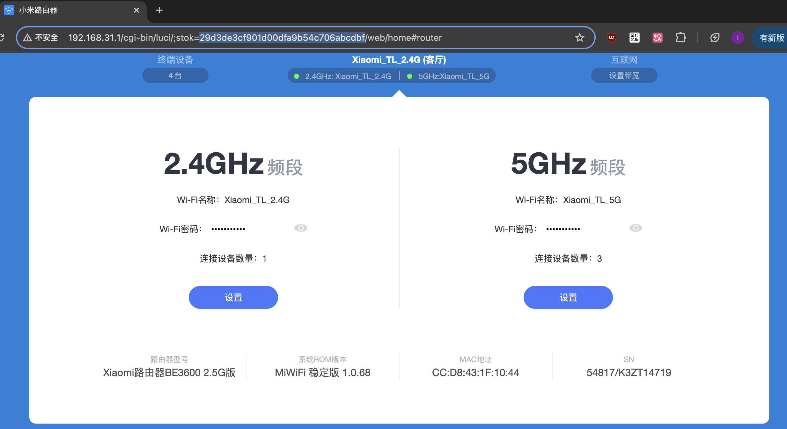

### 确认路由器固件版本
本教程是在稳定版1.0.68操作的，如果发现不能解锁SSH，请将固件版本刷为1.0.68再尝试。




### 获取小米路由器stok
如上图所示，登陆小米路由器后台，在浏览器的地址栏中获取stok并记录，stok为地址中蓝色部分


### 开启小米路由器SSH端口
将下面代码的stok=xxx替换为上一步获取的stok值
```bat
curl -X POST http://192.168.31.1/cgi-bin/luci/;stok=xxx/api/xqsystem/start_binding -d "uid=1234&key=1234'%0Anvram%20set%20ssh_en%3D1'"

curl -X POST http://192.168.31.1/cgi-bin/luci/;stok=xxx/api/xqsystem/start_binding -d "uid=1234&key=1234'%0Anvram%20commit'"

curl -X POST http://192.168.31.1/cgi-bin/luci/;stok=xxx/api/xqsystem/start_binding -d "uid=1234&key=1234'%0Ased%20-i%20's%2Fchannel%3D.*%2Fchannel%3D%22debug%22%2Fg'%20%2Fetc%2Finit.d%2Fdropbear'"

curl -X POST http://192.168.31.1/cgi-bin/luci/;stok=xxx/api/xqsystem/start_binding -d "uid=1234&key=1234'%0A%2Fetc%2Finit.d%2Fdropbear%20start'"

```


打开cmd或terminal，复制上面的代码，然后一行一行的执行，如果返回{"code":0}，则表示操作成功
```text
{"hw":"RD15","sync":false,"code":0,"rtid":"08a62ca2-2142-efca-d6f7-9f0b03628d88","did":"771786011"}
```

### SSH登录路由器
用户名为root，密码需要使用SN计算，[小米路由器密码计算器](https://miwifi.dev/ssh)
```bash
ssh root@192.168.31.1
```

### 固化SSH
确保路由器重启和升级后还能再使用SSH

固化ssh，ssh登录路由器后，执行以下代码
```bash
nvram set ssh_en=1
nvram set telnet_en=1
nvram set uart_en=1
nvram set boot_wait=on
nvram commit
```

永久开启ssh，重启不会关闭

将以下代码保存到 /data/auto_ssh/auto_ssh.sh
```bash
#!/bin/sh

  

auto_ssh_dir="/data/auto_ssh"

host_key="/etc/dropbear/dropbear_rsa_host_key"

host_key_bk="${auto_ssh_dir}/dropbear_rsa_host_key"

  

unlock() {

# Restore the host key.

[ -f $host_key_bk ] && ln -sf $host_key_bk $host_key

  

# Enable telnet, ssh, uart and boot_wait.

[ "$(nvram get telnet_en)" = 0 ] && nvram set telnet_en=1 && nvram commit

[ "$(nvram get ssh_en)" = 0 ] && nvram set ssh_en=1 && nvram commit

[ "$(nvram get uart_en)" = 0 ] && nvram set uart_en=1 && nvram commit

[ "$(nvram get boot_wait)" = "off" ] && nvram set boot_wait=on && nvram commit

  

[ "`uci -c /usr/share/xiaoqiang get xiaoqiang_version.version.CHANNEL`" != 'stable' ] && {

uci -c /usr/share/xiaoqiang set xiaoqiang_version.version.CHANNEL='stable'

uci -c /usr/share/xiaoqiang commit xiaoqiang_version.version 2>/dev/null

}

  

channel=`/sbin/uci get /usr/share/xiaoqiang/xiaoqiang_version.version.CHANNEL`

if [ "$channel" = "release" ]; then

sed -i 's/channel=.*/channel="debug"/g' /etc/init.d/dropbear

fi

  

if [ -z "$(pidof dropbear)" -o -z "$(netstat -ntul | grep :22)" ]; then

/etc/init.d/dropbear restart 2>/dev/null

/etc/init.d/dropbear enable

fi

}

  

install() {

# unlock SSH.

unlock

  

# host key is empty, restart dropbear to generate the host key.

[ -s $host_key ] || /etc/init.d/dropbear restart 2>/dev/null

  

# Backup the host key.

if [ ! -s $host_key_bk ]; then

i=0

while [ $i -le 30 ]

do

if [ -s $host_key ]; then

cp -f $host_key $host_key_bk 2>/dev/null

break

fi

let i++

sleep 1s

done

fi

  

# Add script to system autostart

uci set firewall.auto_ssh=include

uci set firewall.auto_ssh.type='script'

uci set firewall.auto_ssh.path="${auto_ssh_dir}/auto_ssh.sh"

uci set firewall.auto_ssh.enabled='1'

uci commit firewall

echo -e "\033[32m SSH unlock complete. \033[0m"

}

  

uninstall() {

# Remove scripts from system autostart

uci delete firewall.auto_ssh

uci commit firewall

echo -e "\033[33m SSH unlock has been removed. \033[0m"

}

  

main() {

[ -z "$1" ] && unlock && return

case "$1" in

install)

install

;;

uninstall)

uninstall

;;

*)

echo -e "\033[31m Unknown parameter: $1 \033[0m"

return 1

;;

esac

}

  

main "$@"
```

执行以下代码
```
cd  /data/auto_ssh
chmod +x auto_ssh.sh

uci set firewall.auto_ssh=include
uci set firewall.auto_ssh.type='script'
uci set firewall.auto_ssh.path='/data/auto_ssh/auto_ssh.sh'
uci set firewall.auto_ssh.enabled='1'
uci commit firewall
```